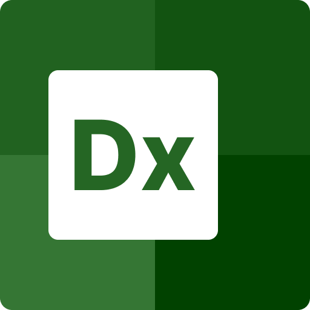
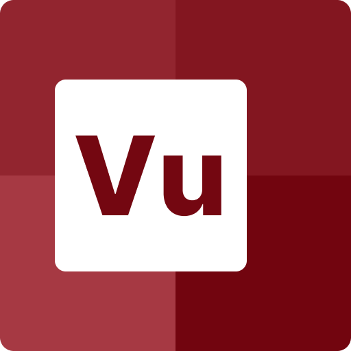

> Project Status: 🚨 Pre Alpha (alpha release target: ~~30 November~~ 31 December 2020)

# VueDX

  

  
  

    
    <h3>
      <a href="https://marketplace.visualstudio.com/items?itemName=znck.vue-language-features-insiders">Language Features</a>
    </h3>
  

  
  

    
    <h3>
      <a href="https://github.com/znck/preview">Preview</a>
    </h3>
  

  

    
    <h3>
      <a href="https://marketplace.visualstudio.com/items?itemName=znck.vue-insiders">Syntax Highlight</a>
    </h3>
  

A set of tools for better developer experience aka Vue Developer Experience.

## VueDX includes:

- [Analyze](./packages/analyze) — statically analyzes Vue components and provides API info.
- [Compiler SFC](./packages/compiler-sfc) — a light weight build of `@vue/compiler-sfc` (only `parse()` functionality is provided).
- [Compiler TSX](./packages/compiler-tsx) — a `<template>` to representational `TSX` compiler (generated TSX may not be functional but ensures type consistency).
- [Preview](https://github.com/znck/preview) — a quick-prototyping and component management tool
- [ProjectConfig](./packages/projectconfig) — a json config file to define project preferences.
- [Template AST Types](./packages/template-ast-types) — a collection of utility functions to work with `<template>` AST, think `@babel/types` but for Vue.
- [Typecheck](./packages/typecheck) — a command line tool to check types, functionally equivalent to `tsc --noEmit` but includes .vue support.
- [TS Plugin](./packages/typescript-plugin-vue) — enables TypeScript language server to understand `.vue` files.
- [TS Plugin for Vetur](./packages/typescript-vetur) — provides missing features to vetur, same as **TS Plugin** but. [#2145](https://github.com/vuejs/vetur/pull/2145)
- [Vue Syntax Highlight](./extensions/vscode-vue) — provides syntax highlight for VS Code.
- [Vue Language Features](./extensions/vscode-vue-language-features) — provides typescript integration for VS Code.
- [Vue Virtual TextDocument](./packages/vue-virtual-textdocument) — creates a virtual file system to represent blocks in SFC as files.
